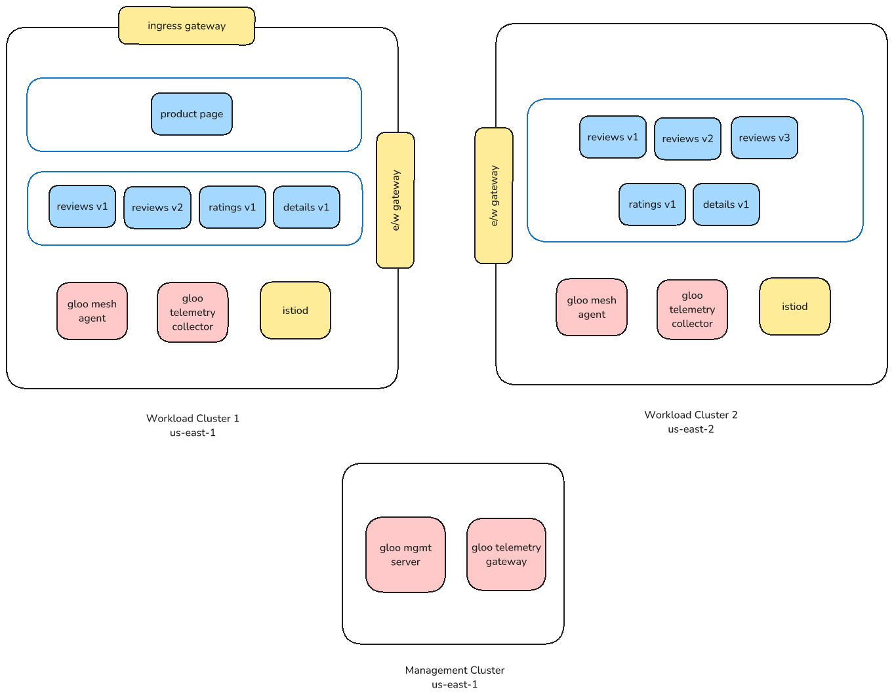
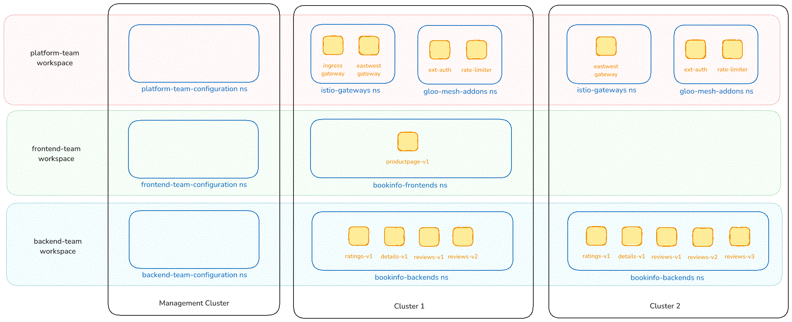

# Gloo Mesh Enterprise Multi-cluster



# Gloo Mesh Management Plane

Set the following environment variables:

```bash
export MGMT=<management-cluster-context>
export CLUSTER1=<1st-workload-cluster-context>
export CLUSTER2=<2nd-workload-cluster-context>

export GLOO_MESH_LICENSE_KEY=<gme-license-key>

export CLUSTER1_NAME=cluster1
export CLUSTER2_NAME=cluster2
export MGMT_NAME=mgmt

export GLOO_MESH_VERSION=2.6.7
export GLOO_ISTIO_REPO_KEY=<repo-key>
export GLOO_ISTIO_IMAGE=1.23.1-solo

echo "Management context = $MGMT"
echo "Cluster1 context = $CLUSTER1"
echo "Cluster2 context = $CLUSTER2"
echo "Management cluster name = $MGMT_NAME"
echo "Cluster1 name = $CLUSTER1_NAME"
echo "Cluster2 name = $CLUSTER2_NAME"
echo "Gloo version = $GLOO_MESH_VERSION"
echo "Gloo repo key = $GLOO_ISTIO_REPO_KEY"
echo "Gloo image = $GLOO_ISTIO_IMAGE"
```

## Gloo Mesh Management Plane

Install the Gloo Mesh management plane with Helm:

```bash
kubectl create namespace --context $MGMT gloo-mesh

helm upgrade --install gloo-platform-crds gloo-platform-crds \
  --repo https://storage.googleapis.com/gloo-platform/helm-charts \
  --namespace gloo-mesh \
  --kube-context $MGMT \
  --version $GLOO_MESH_VERSION

helm upgrade --install gloo-platform gloo-platform \
  --repo https://storage.googleapis.com/gloo-platform/helm-charts \
  --namespace gloo-mesh \
  --kube-context $MGMT \
  --version $GLOO_MESH_VERSION \
  -f- <<EOF
licensing:
  glooMeshLicenseKey: $GLOO_MESH_LICENSE_KEY
common:
  cluster: $MGMT_NAME
glooInsightsEngine:
  enabled: false
glooMgmtServer:
  enabled: true
  ports:
    healthcheck: 8091
prometheus:
  enabled: true
redis:
  deployment:
    enabled: true
telemetryGateway:
  enabled: true
  service:
    type: LoadBalancer
glooUi:
  enabled: true
  serviceType: LoadBalancer
  enabled: true
  config:
    exporters:
      otlp:
        endpoint: gloo-telemetry-gateway:4317
EOF

kubectl --context $MGMT -n gloo-mesh rollout status deployment/gloo-mesh-mgmt-server
```

## Endpoint URLs for the Management Server

Set environment variables for the management endpoints:

```bash
export MGMT_SERVER_IP=$(kubectl get svc -n gloo-mesh gloo-mesh-mgmt-server --context $MGMT -o jsonpath="{.status.loadBalancer.ingress[0]['hostname','ip']}")
export MGMT_SERVER_PORT=$(kubectl get svc -n gloo-mesh gloo-mesh-mgmt-server --context $MGMT -o jsonpath='{.spec.ports[?(@.name=="grpc")].port}')
export MGMT_SERVER_ADDRESS=$MGMT_SERVER_IP:$MGMT_SERVER_PORT

export TELEMETRY_GATEWAY_IP=$(kubectl get svc -n gloo-mesh gloo-telemetry-gateway --context $MGMT -o jsonpath="{.status.loadBalancer.ingress[0]['hostname','ip']}")
export TELEMETRY_GATEWAY_PORT=$(kubectl get svc -n gloo-mesh gloo-telemetry-gateway --context $MGMT -o jsonpath='{.spec.ports[?(@.name=="otlp")].port}')
export TELEMETRY_GATEWAY_ADDRESS=$TELEMETRY_GATEWAY_IP:$TELEMETRY_GATEWAY_PORT

echo "Management server = $MGMT_SERVER_ADDRESS"
echo "Telemetry gateway = $TELEMETRY_GATEWAY_ADDRESS"
```

# Team Workspaces



## Create Team Workspaces

Create namespaces in the management cluster for configurations for the different teams

```bash
kubectl create namespace --context $MGMT platform-team-configuration
kubectl create namespace --context $MGMT frontend-team-configuration
kubectl create namespace --context $MGMT backend-team-configuration
```

Create a Workspace for the platform team

```bash
kubectl apply --context $MGMT -f- <<EOF
apiVersion: admin.gloo.solo.io/v2
kind: Workspace
metadata:
  name: platform-team
  namespace: gloo-mesh
spec:
  workloadClusters:
    - name: $MGMT_NAME
      namespaces:
        - name: 'platform-team-configuration'
    - name: '*'
      namespaces:
        - name: 'gloo-mesh-addons'
        - name: 'istio-gateways'     
EOF
```

Create a Workspace for the Frontend team

```bash
kubectl apply --context $MGMT -f- <<EOF
apiVersion: admin.gloo.solo.io/v2
kind: Workspace
metadata:
  name: frontend-team
  namespace: gloo-mesh
spec:
  workloadClusters:
    - name: $MGMT_NAME
      namespaces:
        - name: 'frontend-team-configuration'
    - name: '*'
      namespaces:
        - name: 'bookinfo-frontends'
EOF
```

Create a Workspace for the Backend API team

```bash
kubectl apply --context $MGMT -f- <<EOF
apiVersion: admin.gloo.solo.io/v2
kind: Workspace
metadata:
  name: backend-team
  namespace: gloo-mesh
spec:
  workloadClusters:
    - name: $MGMT_NAME
      namespaces:
        - name: 'backend-team-configuration'
    - name: '*'
      namespaces:
        - name: 'bookinfo-backends'
EOF
```

## Create Team Workspace Settings

Create the WorkspaceSettings for the platform workspace

```bash
kubectl apply --context $MGMT -f- <<EOF
apiVersion: admin.gloo.solo.io/v2
kind: WorkspaceSettings
metadata:
  name: platform-team
  namespace: platform-team-configuration
spec:
  importFrom:
  - workspaces:
    - name: frontend-team
  exportTo:                
  - workspaces:
    - name: "*"
    resources:
    - kind: SERVICE
      namespace: gloo-mesh-addons
    - kind: VIRTUAL_DESTINATION
      namespace: gloo-mesh-addons
  options:
    federation:
      enabled: true
      serviceSelector:
        - {}
    eastWestGateways:
    - selector:
        labels:
          istio: eastwestgateway
    serviceIsolation:               
      enabled: true
      trimProxyConfig: true
EOF
```

Create the WorkspaceSettings for the frontend workspace. This imports the backend API resources, and gateway and add-ons from the platform team. It also exports services to the platform team so the Gateway can route to them:

```bash
kubectl apply --context $MGMT -f- <<EOF
apiVersion: admin.gloo.solo.io/v2
kind: WorkspaceSettings
metadata:
  name: frontend-team
  namespace: frontend-team-configuration
spec:
  importFrom:
  - workspaces:
    - name: backend-team
  - workspaces:
    - name: platform-team
  exportTo:
  - workspaces:
    - name: platform-team
  options:
    eastWestGateways:
    - selector:
        labels:
          istio: eastwestgateway
    federation:
      enabled: false
    serviceIsolation:
      enabled: true
      trimProxyConfig: true
EOF
```

Create the WorkspaceSettings for the backend workspace. It imports from the platform team to access add-ons. It exports all services to the frontend so that the frontend can call these services.

```bash
kubectl apply --context $MGMT -f- <<EOF
apiVersion: admin.gloo.solo.io/v2
kind: WorkspaceSettings
metadata:
  name: backend-team
  namespace: backend-team-configuration
spec:
  importFrom:
  - workspaces:
    - name: platform-team
  exportTo:
  - workspaces:
    - name: frontend-team
  options: 
    eastWestGateways:
    - selector:
        labels:
          istio: eastwestgateway
    federation:
      enabled: false
    serviceIsolation:
      enabled: true
      trimProxyConfig: true
EOF
```

# Cluster 1 Setup, Istio, and Applications

## Cluster 1 Registration

Register the 1st workload cluster, and set the relay token and certificate

```bash
kubectl apply --context $MGMT -f - <<EOF
apiVersion: admin.gloo.solo.io/v2
kind: KubernetesCluster
metadata:
  name: $CLUSTER1_NAME
  namespace: gloo-mesh
spec:
  clusterDomain: cluster.local
EOF

kubectl --context $CLUSTER1 create namespace gloo-mesh

kubectl get secret relay-root-tls-secret -n gloo-mesh --context $MGMT -o jsonpath='{.data.ca\.crt}' | base64 -d > ca.crt

kubectl create secret generic relay-root-tls-secret -n gloo-mesh --context $CLUSTER1 --from-file ca.crt=ca.crt
rm ca.crt

kubectl get secret relay-identity-token-secret -n gloo-mesh --context $MGMT -o jsonpath='{.data.token}' | base64 -d > token

kubectl create secret generic relay-identity-token-secret -n gloo-mesh --context $CLUSTER1 --from-file token=token
rm token
```

## Install Gloo on Cluster 1

Install the Gloo Mesh agent and telemetry collector on the 1st workload cluster:

```bash
helm upgrade --install gloo-platform-crds gloo-platform-crds \
  --repo https://storage.googleapis.com/gloo-platform/helm-charts \
  --namespace gloo-mesh \
  --kube-context $CLUSTER1 \
  --version $GLOO_MESH_VERSION

helm upgrade --install gloo-platform gloo-platform \
  --repo https://storage.googleapis.com/gloo-platform/helm-charts \
  --namespace gloo-mesh \
  --kube-context $CLUSTER1 \
  --version $GLOO_MESH_VERSION \
  -f -<<EOF
common:
  cluster: $CLUSTER1_NAME
glooAgent:
  enabled: true
  relay:
    serverAddress: "$MGMT_SERVER_ADDRESS"
    authority: gloo-mesh-mgmt-server.gloo-mesh
telemetryCollector:
  enabled: true
  config:
    exporters:
      otlp:
        endpoint: "$TELEMETRY_GATEWAY_ADDRESS"
EOF

kubectl rollout status -n gloo-mesh --context $CLUSTER1 deployment/gloo-mesh-agent
```

Check status of the mesh:

```bash
meshctl --kubecontext $MGMT check

pod=$(kubectl --context $MGMT -n gloo-mesh get pods -l app=gloo-mesh-mgmt-server -o jsonpath='{.items[0].metadata.name}')
kubectl --context $MGMT -n gloo-mesh debug -q -i $pod --profile=general --image=curlimages/curl -- curl -s http://localhost:9091/metrics | grep relay_push_clients_connected
```

## Install Gloo Add-ons

Install External Auth and Rate Limiting on the first cluster

```bash
kubectl --context $MGMT create namespace gloo-mesh-addons
kubectl --context $CLUSTER1 create namespace gloo-mesh-addons
kubectl --context $CLUSTER1 label namespace gloo-mesh-addons istio-injection=enabled --overwrite

helm upgrade --install gloo-platform gloo-platform \
  --repo https://storage.googleapis.com/gloo-platform/helm-charts \
  --namespace gloo-mesh-addons \
  --kube-context $CLUSTER1 \
  --version $GLOO_MESH_VERSION \
  -f- <<EOF
common:
  cluster: $CLUSTER1_NAME
glooAgent:
  enabled: false
extAuthService:
  enabled: true
  extAuth:
    apiKeyStorage:
      name: redis
      enabled: true
      config: 
        connection: 
          host: redis.gloo-mesh-addons:6379
      secretKey: ThisIsSecret
rateLimiter:
  enabled: true
EOF

kubectl rollout status -n gloo-mesh-addons --context $CLUSTER1 deployment/ext-auth-service
kubectl rollout status -n gloo-mesh-addons --context $CLUSTER1 deployment/rate-limiter
```

## Istio Installation

### Ingress and E/W Gateway Services

Create a service for the ingress gateway

```bash
kubectl --context $CLUSTER1 create ns istio-gateways

kubectl apply --context $CLUSTER1 -f- <<EOF
apiVersion: v1
kind: Service
metadata:
  labels:
    app: istio-ingressgateway
    istio: ingressgateway
  name: istio-ingressgateway
  namespace: istio-gateways
spec:
  ports:
  - name: http2
    port: 80
    protocol: TCP
    targetPort: 8080
  - name: https
    port: 443
    protocol: TCP
    targetPort: 8443
  selector:
    app: istio-ingressgateway
    istio: ingressgateway
  type: LoadBalancer
EOF
```

Create a service for the east-west gateway:

```bash
kubectl apply --context $CLUSTER1 -f- <<EOF
apiVersion: v1
kind: Service
metadata:
  labels:
    app: istio-egressgateway
    istio: eastwestgateway
    topology.istio.io/network: $CLUSTER1_NAME
  name: istio-eastwestgateway
  namespace: istio-gateways
spec:
  ports:
  - name: status-port
    port: 15021
    protocol: TCP
    targetPort: 15021
  - name: tls
    port: 15443
    protocol: TCP
    targetPort: 15443
  - name: https
    port: 16443
    protocol: TCP
    targetPort: 16443
  - name: tls-spire
    port: 8081
    protocol: TCP
    targetPort: 8081
  - name: tls-otel
    port: 4317
    protocol: TCP
    targetPort: 4317
  - name: grpc-cacert
    port: 31338
    protocol: TCP
    targetPort: 31338
  - name: grpc-ew-bootstrap
    port: 31339
    protocol: TCP
    targetPort: 31339
  - name: tcp-istiod
    port: 15012
    protocol: TCP
    targetPort: 15012
  - name: tcp-webhook
    port: 15017
    protocol: TCP
    targetPort: 15017
  selector:
    app: istio-eastwestgateway
    istio: eastwestgateway
    topology.istio.io/network: $CLUSTER1_NAME
  type: LoadBalancer
EOF
```

Verify the services are created with an external IP:

```bash
kubectl get services --context $CLUSTER1 --namespace istio-gateways
```

### Istiod and Gateways

Install istiod in the 1st workload cluster with Helm:

```bash
helm upgrade --install istio-base oci://us-docker.pkg.dev/gloo-mesh/istio-helm-$GLOO_ISTIO_REPO_KEY/base \
--namespace istio-system \
--kube-context $CLUSTER1 \
--version $GLOO_ISTIO_IMAGE \
--create-namespace

helm upgrade --install istiod oci://us-docker.pkg.dev/gloo-mesh/istio-helm-$GLOO_ISTIO_REPO_KEY/istiod \
--namespace istio-system \
--kube-context $CLUSTER1 \
--version $GLOO_ISTIO_IMAGE \
--create-namespace \
-f - <<EOF
global:
  proxy:
    clusterDomain: cluster.local
  multiCluster:
    clusterName: $CLUSTER1_NAME
  meshID: mesh1
  network: $CLUSTER1_NAME
meshConfig:
  accessLogFile: /dev/stdout
  defaultConfig:
    proxyMetadata:
      ISTIO_META_DNS_AUTO_ALLOCATE: "true"
      ISTIO_META_DNS_CAPTURE: "true"
  trustDomain: $CLUSTER1_NAME
pilot:
  enabled: true
  env:
    PILOT_ENABLE_IP_AUTOALLOCATE: "true"
    PILOT_ENABLE_K8S_SELECT_WORKLOAD_ENTRIES: "false"
    PILOT_SKIP_VALIDATE_TRUST_DOMAIN: "true"
EOF

```

Install an ingress gateway in the 1st workload cluster with Helm:

```bash
helm upgrade --install istio-ingressgateway oci://us-docker.pkg.dev/gloo-mesh/istio-helm-$GLOO_ISTIO_REPO_KEY/gateway \
--namespace istio-gateways \
--kube-context $CLUSTER1 \
--version $GLOO_ISTIO_IMAGE \
--create-namespace \
-f - <<EOF
autoscaling:
  enabled: false
imagePullPolicy: IfNotPresent
labels:
  app: istio-ingressgateway
  istio: ingressgateway
service:
  type: None
EOF
```

Install the east-west gateway in the 1st workload cluster with Helm:

```bash
helm upgrade --install istio-eastwestgateway oci://us-docker.pkg.dev/gloo-mesh/istio-helm-$GLOO_ISTIO_REPO_KEY/gateway \
--namespace istio-gateways \
--kube-context $CLUSTER1 \
--version $GLOO_ISTIO_IMAGE \
--create-namespace \
-f - <<EOF
autoscaling:
  enabled: false
imagePullPolicy: IfNotPresent
env:
  ISTIO_META_ROUTER_MODE: sni-dnat
labels:
  app: istio-eastwestgateway
  istio: eastwestgateway
  topology.istio.io/network: $CLUSTER1_NAME
service:
  type: None
EOF
```

## Sample Application Installation

### bookinfo

Install the bookinfo sample application, with the frontend and versions 1 and 2 of the reviews service:

```bash
kubectl create namespace --context $MGMT bookinfo-frontends
kubectl create namespace --context $MGMT bookinfo-backends
kubectl create namespace --context $CLUSTER1 bookinfo-frontends
kubectl create namespace --context $CLUSTER1 bookinfo-backends
kubectl label namespace --context $CLUSTER1 bookinfo-frontends istio-injection=enabled --overwrite
kubectl  label namespace --context $CLUSTER1 bookinfo-backends istio-injection=enabled --overwrite

kubectl apply -n bookinfo-frontends --context $CLUSTER1 -f https://raw.githubusercontent.com/solo-io/workshops/refs/heads/master/gloo-mesh/enterprise/2-6/default/data/steps/deploy-bookinfo/productpage-v1.yaml

kubectl apply -n bookinfo-backends --context $CLUSTER1  \
  -f https://raw.githubusercontent.com/solo-io/workshops/refs/heads/master/gloo-mesh/enterprise/2-6/default/data/steps/deploy-bookinfo/details-v1.yaml \
  -f https://raw.githubusercontent.com/solo-io/workshops/refs/heads/master/gloo-mesh/enterprise/2-6/default/data/steps/deploy-bookinfo/ratings-v1.yaml \
  -f https://raw.githubusercontent.com/solo-io/workshops/refs/heads/master/gloo-mesh/enterprise/2-6/default/data/steps/deploy-bookinfo/reviews-v1-v2.yaml

kubectl set env -n bookinfo-backends --context $CLUSTER1 deploy/reviews-v1 CLUSTER_NAME=$CLUSTER1_NAME
kubectl set env -n bookinfo-backends --context $CLUSTER1 deploy/reviews-v2 CLUSTER_NAME=$CLUSTER1_NAME

kubectl rollout status -n bookinfo-frontends --context $CLUSTER1 deployment/productpage-v1
kubectl rollout status -n bookinfo-backends --context $CLUSTER1 deployment/reviews-v1
```

Check the pods’ status

```bash
kubectl get pods --context $CLUSTER1 -n bookinfo-frontends
kubectl get pods --context $CLUSTER1 -n bookinfo-backends
```

Forward port 9080 to the productpage pod, and open [http://localhost:9080](http://localhost:9080) in a browser:

```bash
kubectl port-forward --context $CLUSTER1 -n bookinfo-frontends deployments/productpage-v1 9080
```

### httpbin

Install 2 versions of httpbin, one that is in the mesh, and one that is not. Note the [sidecar.istio.io/inject](http://sidecar.istio.io/inject) label in the deployment that isn’t in the mesh:

```bash
kubectl --context $CLUSTER1 create namespace httpbin
kubectl --context $CLUSTER1 label namespace httpbin istio-injection=enabled --overwrite

kubectl --context $CLUSTER1 apply -f- <<EOF
apiVersion: v1
kind: ServiceAccount
metadata:
  name: not-in-mesh
  namespace: httpbin
---
apiVersion: v1
kind: Service
metadata:
  name: not-in-mesh
  namespace: httpbin
  labels:
    app: not-in-mesh
    service: not-in-mesh
spec:
  ports:
  - name: http
    port: 8000
    targetPort: 80
  selector:
    app: not-in-mesh
---
apiVersion: apps/v1
kind: Deployment
metadata:
  name: not-in-mesh
  namespace: httpbin
spec:
  replicas: 1
  selector:
    matchLabels:
      app: not-in-mesh
      version: v1
  template:
    metadata:
      labels:
        app: not-in-mesh
        version: v1
        sidecar.istio.io/inject: "false"
    spec:
      serviceAccountName: not-in-mesh
      containers:
      - image: kennethreitz/httpbin
        imagePullPolicy: IfNotPresent
        name: in-mesh
        ports:
        - name: http
          containerPort: 80
        livenessProbe:
          httpGet:
            path: /status/200
            port: http
        readinessProbe:
          httpGet:
            path: /status/200
            port: http
---
apiVersion: v1
kind: ServiceAccount
metadata:
  name: in-mesh
  namespace: httpbin
---
apiVersion: v1
kind: Service
metadata:
  name: in-mesh
  namespace: httpbin
  labels:
    app: in-mesh
    service: in-mesh
spec:
  ports:
  - name: http
    port: 8000
    targetPort: 80
  selector:
    app: in-ambient
---
apiVersion: apps/v1
kind: Deployment
metadata:
  name: in-mesh
  namespace: httpbin
spec:
  replicas: 1
  selector:
    matchLabels:
      app: in-mesh
      version: v1
  template:
    metadata:
      labels:
        app: in-mesh
        version: v1
    spec:
      serviceAccountName: in-mesh
      containers:
      - image: kennethreitz/httpbin
        imagePullPolicy: IfNotPresent
        name: in-mesh
        ports:
        - name: http
          containerPort: 80
        livenessProbe:
          httpGet:
            path: /status/200
            port: http
        readinessProbe:
          httpGet:
            path: /status/200
            port: http
EOF

kubectl rollout status -n httpbin --context $CLUSTER1 deployment/not-in-mesh
kubectl rollout status -n httpbin --context $CLUSTER1 deployment/in-mesh
```

Check the pods’ status:

```bash
kubectl get pods --context $CLUSTER1 -n httpbin
```

Make sure you can access the httpbin applications with curl:

```bash
not_in_mesh_pod=$(kubectl --context $CLUSTER1 -n httpbin get pods -l app=not-in-mesh -o jsonpath='{.items[0].metadata.name}')

in_mesh_pod=$(kubectl --context $CLUSTER1 -n httpbin get pods -l app=in-mesh -o jsonpath='{.items[0].metadata.name}')

kubectl --context $CLUSTER1 -n httpbin debug -q -i $not_in_mesh_pod --profile=general --image=curlimages/curl -- curl -sik http://localhost/anything/not-in-mesh-httpbin

kubectl --context $CLUSTER1 -n httpbin debug -q -i $in_mesh_pod --profile=general --image=curlimages/curl -- curl -sik http://localhost/anything/in-mesh-httpbin
```

## Create a Gateway for bookinfo

Get the hostname of the ingress gateway. Alternatively you can create a CNAME record that points to the ingress gateway and use that record for PRODUCT_PAGE_HOSTNAME:

```bash
export PRODUCT_PAGE_HOSTNAME=$(kubectl get svc --context $CLUSTER1 -n istio-gateways istio-ingressgateway -o jsonpath='{.status.loadBalancer.ingress[0].hostname}')

echo $PRODUCT_PAGE_HOSTNAME
```

Create a VirtualGateway for the ingress gateway that includes all hostnames:

```bash
kubectl apply --context $CLUSTER1 -f - <<EOF
apiVersion: networking.gloo.solo.io/v2
kind: VirtualGateway
metadata:
  name: default-gw
  namespace: istio-gateways
spec:
  workloads:
    - selector:
        labels:
          istio: ingressgateway
        cluster: $CLUSTER1_NAME
  listeners: 
    - http: {}
      port:
        number: 80
      allowedRouteTables:
        - host: '*'
EOF

```

Create a RouteTable for the productpage that is attached to the VirtualGateway:

```bash
kubectl apply  --context $CLUSTER1 -f - <<EOF
apiVersion: networking.gloo.solo.io/v2
kind: RouteTable
metadata:
  name: bookinfo
  namespace: istio-gateways
spec:
  hosts:
    - $PRODUCT_PAGE_HOSTNAME
  virtualGateways:
    - name: default-gw
      namespace: istio-gateways
      cluster: $CLUSTER1_NAME
  workloadSelectors: []
  http:
    - name: productpage
      matchers:
      - uri:
          exact: /productpage
      - uri:
          prefix: /static
      - uri:
          prefix: /api/v1/products
      forwardTo:
        destinations:
          - ref:
              name: productpage
              namespace: bookinfo-frontends
              cluster: $CLUSTER1_NAME
            port:
              number: 9080

EOF
```

Test that you can access the bookinfo application in a browser:

```bash
open $(echo "http://$PRODUCT_PAGE_HOSTNAME/productpage")
```

# Cluster 2 Setup, Istio and Applications

## Cluster 2 Registration

Register the 2nd workload cluster, and set the relay token and certificate

```bash
kubectl apply --context $MGMT -f - <<EOF
apiVersion: admin.gloo.solo.io/v2
kind: KubernetesCluster
metadata:
  name: $CLUSTER2_NAME
  namespace: gloo-mesh
spec:
  clusterDomain: cluster.local
EOF

kubectl --context $CLUSTER2 create namespace gloo-mesh

kubectl get secret relay-root-tls-secret -n gloo-mesh --context $MGMT -o jsonpath='{.data.ca\.crt}' | base64 -d > ca.crt

kubectl create secret generic relay-root-tls-secret -n gloo-mesh --context $CLUSTER2 --from-file ca.crt=ca.crt
rm ca.crt

kubectl get secret relay-identity-token-secret -n gloo-mesh --context $MGMT -o jsonpath='{.data.token}' | base64 -d > token

kubectl create secret generic relay-identity-token-secret -n gloo-mesh --context $CLUSTER2 --from-file token=token
rm token
```

## Install Gloo on Cluster 2

Install the Gloo Mesh agent and telemetry collector on the 2nd workload cluster

```bash
helm upgrade --install gloo-platform-crds gloo-platform-crds \
  --repo https://storage.googleapis.com/gloo-platform/helm-charts \
  --namespace gloo-mesh \
  --kube-context $CLUSTER2 \
  --version $GLOO_MESH_VERSION

helm upgrade --install gloo-platform gloo-platform \
  --repo https://storage.googleapis.com/gloo-platform/helm-charts \
  --namespace gloo-mesh \
  --kube-context $CLUSTER2 \
  --version $GLOO_MESH_VERSION \
  -f -<<EOF
common:
  cluster: $CLUSTER2_NAME
glooAgent:
  enabled: true
  relay:
    serverAddress: "$MGMT_SERVER_ADDRESS"
    authority: gloo-mesh-mgmt-server.gloo-mesh
telemetryCollector:
  enabled: true
  config:
    exporters:
      otlp:
        endpoint: "$TELEMETRY_GATEWAY_ADDRESS"
EOF

kubectl rollout status -n gloo-mesh --context $CLUSTER2 deployment/gloo-mesh-agent
```

Check the status of the mesh

```bash
meshctl --kubecontext $MGMT check

pod=$(kubectl --context $MGMT -n gloo-mesh get pods -l app=gloo-mesh-mgmt-server -o jsonpath='{.items[0].metadata.name}')
kubectl --context $MGMT -n gloo-mesh debug -q -i $pod --profile=general --image=curlimages/curl -- curl -s http://localhost:9091/metrics | grep relay_push_clients_connected
```

## Install Gloo Add-ons

Install External Auth and Rate Limiter on the 2nd cluster

```bash
kubectl --context $CLUSTER2 create namespace gloo-mesh-addons
kubectl --context $CLUSTER2 label namespace gloo-mesh-addons istio-injection=enabled --overwrite

helm upgrade --install gloo-platform gloo-platform \
  --repo https://storage.googleapis.com/gloo-platform/helm-charts \
  --namespace gloo-mesh-addons \
  --kube-context $CLUSTER2 \
  --version $GLOO_MESH_VERSION \
  -f- <<EOF
common:
  cluster: $CLUSTER2_NAME
glooAgent:
  enabled: false
extAuthService:
  enabled: true
  extAuth:
    apiKeyStorage:
      name: redis
      enabled: true
      config: 
        connection: 
          host: redis.gloo-mesh-addons:6379
      secretKey: ThisIsSecret
rateLimiter:
  enabled: true
EOF

kubectl rollout status -n gloo-mesh-addons --context $CLUSTER2 deployment/ext-auth-service
kubectl rollout status -n gloo-mesh-addons --context $CLUSTER2 deployment/rate-limiter
```

## Istio Installation

### E/W Gateway Service

Create a service for the east-west gateway:

```bash
kubectl --context $CLUSTER2 create ns istio-gateways

kubectl apply --context $CLUSTER2 -f- <<EOF
apiVersion: v1
kind: Service
metadata:
  labels:
    app: istio-eastwestgateway
    istio: eastwestgateway
    topology.istio.io/network: $CLUSTER2_NAME
  name: istio-eastwestgateway
  namespace: istio-gateways
spec:
  ports:
  - name: status-port
    port: 15021
    protocol: TCP
    targetPort: 15021
  - name: tls
    port: 15443
    protocol: TCP
    targetPort: 15443
  - name: https
    port: 16443
    protocol: TCP
    targetPort: 16443
  - name: tls-spire
    port: 8081
    protocol: TCP
    targetPort: 8081
  - name: tls-otel
    port: 4317
    protocol: TCP
    targetPort: 4317
  - name: grpc-cacert
    port: 31338
    protocol: TCP
    targetPort: 31338
  - name: grpc-ew-bootstrap
    port: 31339
    protocol: TCP
    targetPort: 31339
  - name: tcp-istiod
    port: 15012
    protocol: TCP
    targetPort: 15012
  - name: tcp-webhook
    port: 15017
    protocol: TCP
    targetPort: 15017
  selector:
    app: istio-eastwestgateway
    istio: eastwestgateway
    topology.istio.io/network: $CLUSTER2_NAME
  type: LoadBalancer
EOF
```

Verify the service is created with an external IP:

```bash
kubectl get services --context $CLUSTER2 --namespace istio-gateways
```

### Istiod and E/W Gateway

Install istiod in the 2nd workload cluster with Helm:

```bash
helm upgrade --install istio-base oci://us-docker.pkg.dev/gloo-mesh/istio-helm-$GLOO_ISTIO_REPO_KEY/base \
--namespace istio-system \
--kube-context $CLUSTER2 \
--version $GLOO_ISTIO_IMAGE \
--create-namespace

helm upgrade --install istiod oci://us-docker.pkg.dev/gloo-mesh/istio-helm-$GLOO_ISTIO_REPO_KEY/istiod \
--namespace istio-system \
--kube-context $CLUSTER2 \
--version $GLOO_ISTIO_IMAGE \
--create-namespace \
-f - <<EOF
global:
  proxy:
    clusterDomain: cluster.local
  multiCluster:
    clusterName: $CLUSTER2_NAME
  meshID: mesh1
  network: $CLUSTER2_NAME
meshConfig:
  accessLogFile: /dev/stdout
  defaultConfig:
    proxyMetadata:
      ISTIO_META_DNS_AUTO_ALLOCATE: "true"
      ISTIO_META_DNS_CAPTURE: "true"
  trustDomain: $CLUSTER2_NAME
pilot:
  enabled: true
  env:
    PILOT_ENABLE_IP_AUTOALLOCATE: "true"
    PILOT_ENABLE_K8S_SELECT_WORKLOAD_ENTRIES: "false"
    PILOT_SKIP_VALIDATE_TRUST_DOMAIN: "true"
EOF

```

Install the east-west gateway in the 2nd workload cluster with Helm:

```bash
helm upgrade --install istio-eastwestgateway oci://us-docker.pkg.dev/gloo-mesh/istio-helm-$GLOO_ISTIO_REPO_KEY/gateway \
--namespace istio-gateways \
--kube-context $CLUSTER2 \
--version $GLOO_ISTIO_IMAGE \
--create-namespace \
-f - <<EOF
autoscaling:
  enabled: false
imagePullPolicy: IfNotPresent
env:
  ISTIO_META_ROUTER_MODE: sni-dnat
labels:
  app: istio-eastwestgateway
  istio: eastwestgateway
  topology.istio.io/network: $CLUSTER2_NAME
service:
  type: None
EOF
```

## Sample Application Installation

### bookinfo

Install the bookinfo sample application on the 2nd workload cluster, with versions 1, 2, and 3 of the reviews service. We don’t need the frontend on this cluster:

```bash
kubectl create namespace --context $CLUSTER2 bookinfo-backends
kubectl label namespace  --context $CLUSTER2 bookinfo-backends istio-injection=enabled --overwrite

kubectl -n bookinfo-backends --context $CLUSTER2 apply \
  -f https://raw.githubusercontent.com/solo-io/workshops/refs/heads/master/gloo-mesh/enterprise/2-6/default/data/steps/deploy-bookinfo/details-v1.yaml \
  -f https://raw.githubusercontent.com/solo-io/workshops/refs/heads/master/gloo-mesh/enterprise/2-6/default/data/steps/deploy-bookinfo/ratings-v1.yaml \
  -f https://raw.githubusercontent.com/solo-io/workshops/refs/heads/master/gloo-mesh/enterprise/2-6/default/data/steps/deploy-bookinfo/reviews-v1-v2.yaml \
  -f https://raw.githubusercontent.com/solo-io/workshops/refs/heads/master/gloo-mesh/enterprise/2-6/default/data/steps/deploy-bookinfo/reviews-v3.yaml

kubectl set env -n bookinfo-backends --context $CLUSTER2 deploy/reviews-v1 CLUSTER_NAME=$CLUSTER2_NAME
kubectl set env -n bookinfo-backends --context $CLUSTER2 deploy/reviews-v2 CLUSTER_NAME=$CLUSTER2_NAME
kubectl set env -n bookinfo-backends --context $CLUSTER2 deploy/reviews-v3 CLUSTER_NAME=$CLUSTER2_NAME

kubectl rollout status -n bookinfo-backends --context $CLUSTER2 deployment/reviews-v1
```

Check the pods’ status:

```bash
kubectl get pods --context $CLUSTER2 -n bookinfo-backends
```

# Set Up Cross-cluster Traffic

## Root Trust Authority

Create a root trust that workload cluster intermediate CAs can use for workload certificates:

```bash
kubectl apply --context $MGMT -f - <<EOF
apiVersion: admin.gloo.solo.io/v2
kind: RootTrustPolicy
metadata:
  name: root-trust-policy
  namespace: gloo-mesh
spec:
  config:
    mgmtServerCa:
      generated: {}
EOF
```

Restart all of the workload cluster workloads to force generation of new certificates. By default, certificates are rotated every 24 hours; we don’t want to wait that long:

```bash
kubectl rollout restart -n istio-system --context $CLUSTER1 deployment/istiod
kubectl rollout restart -n istio-gateways --context $CLUSTER1 deployment/istio-eastwestgateway
kubectl rollout restart -n istio-gateways --context $CLUSTER1 deployment/istio-ingressgateway
kubectl rollout restart -n bookinfo-frontends --context $CLUSTER1 deployment/productpage-v1
kubectl rollout restart -n bookinfo-backends --context $CLUSTER1 deployment/details-v1
kubectl rollout restart -n bookinfo-backends --context $CLUSTER1 deployment/ratings-v1
kubectl rollout restart -n bookinfo-backends --context $CLUSTER1 deployment/reviews-v1
kubectl rollout restart -n bookinfo-backends --context $CLUSTER1 deployment/reviews-v2

kubectl rollout restart -n istio-system --context $CLUSTER2 deployment/istiod
kubectl rollout restart -n istio-gateways  --context $CLUSTER2 deployment/istio-eastwestgateway
kubectl rollout restart -n bookinfo-backends --context $CLUSTER2 deployment/details-v1
kubectl rollout restart -n bookinfo-backends --context $CLUSTER2 deployment/ratings-v1
kubectl rollout restart -n bookinfo-backends --context $CLUSTER2 deployment/reviews-v1
kubectl rollout restart -n bookinfo-backends --context $CLUSTER2 deployment/reviews-v2
kubectl rollout restart -n bookinfo-backends --context $CLUSTER2 deployment/reviews-v3
```

Wait for the pods to come up:

```bash
kubectl get pods -n bookinfo-backends --context $CLUSTER1
kubectl get pods -n bookinfo-backends --context $CLUSTER2
```

## Virtual Destination for Reviews

Create a VirtualDestination that routes to all clusters’ reviews service. This VirtualDestination has a hostname of reviews.global:

```bash
kubectl apply --context $MGMT -f - <<EOF
apiVersion: networking.gloo.solo.io/v2
kind: VirtualDestination
metadata:
  name: reviews
  namespace: bookinfo-backends
spec:
  hosts:
  - reviews.global
  services:
  - namespace: bookinfo-backends
    labels:
      app: reviews
  ports:
    - number: 9080
      protocol: HTTP
EOF
```

Check that traffic is routed to the reviews services in both clusters. Run this command several times and you should see responses from the reviews services in both clusters:

```bash
pod=$(kubectl --context ${CLUSTER1} -n bookinfo-frontends get pods -l app=productpage -o jsonpath='{.items[0].metadata.name}')

for i in {1..10}; do kubectl --context $CLUSTER1 -n bookinfo-frontends debug -i -q --profile=general $pod --image=curlimages/curl -- curl -i http://reviews.global:9080/reviews/0 | grep cluster; done
```

## Update reviews hostname in productpage

Update the productpage deployment to use the [reviews.global](http://reviews.global) hostname instead of reviews.bookinfo-backends.svc.cluster.local:

```bash
kubectl --context $CLUSTER1 -n bookinfo-frontends set env deploy/productpage-v1 REVIEWS_HOSTNAME=reviews.global

kubectl rollout restart --context $CLUSTER1 -n bookinfo-frontends deployment/productpage-v1

kubectl rollout status --context $CLUSTER1 -n bookinfo-frontends deployment/productpage-v1
```

Open the productpage, refresh the page a few times, and verify reviews are coming from both clusters:

```bash
open $(echo "http://$PRODUCT_PAGE_HOSTNAME/productpage")
```

# Cluster Failover

Create a failover policy and outlier detection policy that fails over requests to a 2nd region if needed:

```bash
kubectl apply --context $MGMT -f - <<EOF
apiVersion: resilience.policy.gloo.solo.io/v2
kind: FailoverPolicy
metadata:
  name: failover
  namespace: bookinfo-backends
spec:
  applyToDestinations:
  - kind: VIRTUAL_DESTINATION
    selector:
      labels:
        failover: "true"
  config:
    localityMappings: []
---
apiVersion: resilience.policy.gloo.solo.io/v2
kind: OutlierDetectionPolicy
metadata:
  name: outlier-detection
  namespace: bookinfo-backends
spec:
  applyToDestinations:
  - kind: VIRTUAL_DESTINATION
    selector:
      labels:
        failover: "true"
  config:
    consecutiveErrors: 2
    interval: 5s
    baseEjectionTime: 30s
    maxEjectionPercent: 100
EOF
```

Update the Virtual Destination to add the label ‘failover=true’:

```bash
kubectl apply --context $MGMT -f- <<EOF
apiVersion: networking.gloo.solo.io/v2
kind: VirtualDestination
metadata:
  name: reviews
  namespace: bookinfo-backends
  labels:
    failover: "true"
spec:
  hosts:
  - reviews.global
  services:
  - namespace: bookinfo-backends
    labels:
      app: reviews
  ports:
    - number: 9080
      protocol: HTTP
EOF
```

Verify all traffic is sent to the first cluster:

```bash
for i in {1..20}; do  kubectl --context $CLUSTER1 -n bookinfo-frontends exec deploy/productpage-v1 -- python -c "import requests; r = requests.get('http://reviews.global:9080/reviews/0'); print(r.text)" | grep cluster; done
```

Scale down the reviews pods in the first cluster and verify all traffic is sent to the 2nd cluster:

```bash
kubectl scale -n bookinfo-backends --context $CLUSTER1 deployment/reviews-v1 --replicas=0
kubectl scale -n bookinfo-backends --context $CLUSTER1 deployment/reviews-v2 --replicas=0

for i in {1..20}; do  kubectl --context $CLUSTER1 -n bookinfo-frontends exec deploy/productpage-v1 -- python -c "import requests; r = requests.get('http://reviews.global:9080/reviews/0'); print(r.text)" | grep cluster; done
```

Scale the 1st clusters pods back up:

```bash
kubectl scale -n bookinfo-backends --context $CLUSTER1 deployment/reviews-v1 --replicas=1
kubectl scale -n bookinfo-backends --context $CLUSTER1 deployment/reviews-v2 --replicas=1
```

Remove the failover and outlier detection policies

```bash
kubectl delete failoverpolicy --context $MGMT -n bookinfo-backends failover
kubectl delete outlierdetectionpolicy --context $MGMT -n bookinfo-backends outlier-detection
```

# Splitting Traffic across Localities

Create a failover policy that splits traffic between localities:

```bash
kubectl apply --context $MGMT -f- <<EOF
apiVersion: resilience.policy.gloo.solo.io/v2
kind: FailoverPolicy
metadata:
  name: locality-based-failover
  namespace: bookinfo-backends
spec:
  applyToDestinations:
  - kind: VIRTUAL_DESTINATION
    selector:
      labels:
        failover: "true"
  config:
    localityMappings:
    - from:
        region: us-east-1
      to:
      - region: us-east-1
        weight: 75
      - region: us-east-2
        weight: 25
EOF
```

Verify that ~75% of the traffic (15/20 requests) goes to the 1st cluster, and the rest goes to the 2nd cluster:

```bash
for i in {1..20}; do  kubectl --context $CLUSTER1 -n bookinfo-frontends exec deploy/productpage-v1 -- python -c "import requests; r = requests.get('http://reviews.global:9080/reviews/0'); print(r.text)" | grep cluster; done
```

Route 100% of the traffic to the 2nd cluster in the failover policy:

```bash
kubectl apply --context $MGMT -f- <<EOF
apiVersion: resilience.policy.gloo.solo.io/v2
kind: FailoverPolicy
metadata:
  name: locality-based-failover
  namespace: bookinfo-backends
spec:
  applyToDestinations:
  - kind: VIRTUAL_DESTINATION
    selector:
      labels:
        failover: "true"
  config:
    localityMappings:
    - from:
        region: us-east-1
      to:
      - region: us-east-1
        weight: 1
      - region: us-east-2
        weight: 99
EOF
```

Verify that all traffic goes to cluster 2:

```bash
for i in {1..20}; do  kubectl --context $CLUSTER1 -n bookinfo-frontends exec deploy/productpage-v1 -- python -c "import requests; r = requests.get('http://reviews.global:9080/reviews/0'); print(r.text)" | grep cluster; done
```

Scale down the review pods in cluster 2:

```bash
kubectl scale -n bookinfo-backends --context $CLUSTER2 deployment/reviews-v1 --replicas=0
kubectl scale -n bookinfo-backends --context $CLUSTER2 deployment/reviews-v2 --replicas=0
kubectl scale -n bookinfo-backends --context $CLUSTER2 deployment/reviews-v3 --replicas=0
```

Verify the traffic fails over to cluster 1:

```bash
for i in {1..20}; do  kubectl --context $CLUSTER1 -n bookinfo-frontends exec deploy/productpage-v1 -- python -c "import requests; r = requests.get('http://reviews.global:9080/reviews/0'); print(r.text)" | grep cluster; done
```

Cleanup the failover policy,  scale the reviews pods in cluster 2 back up, and update the VirtualDestination:

```bash
kubectl delete failoverpolicy --context $MGMT -n bookinfo-backends locality-based-failover

kubectl scale -n bookinfo-backends --context $CLUSTER2 deployment/reviews-v1 --replicas=1
kubectl scale -n bookinfo-backends --context $CLUSTER2 deployment/reviews-v2 --replicas=1
kubectl scale -n bookinfo-backends --context $CLUSTER2 deployment/reviews-v3 --replicas=1

kubectl apply --context $MGMT -f- <<EOF
apiVersion: networking.gloo.solo.io/v2
kind: VirtualDestination
metadata:
  name: reviews
  namespace: bookinfo-backends
spec:
  hosts:
  - reviews.global
  services:
  - namespace: bookinfo-backends
    labels:
      app: reviews
  ports:
    - number: 9080
      protocol: HTTP
EOF
```

# Session Affinity

Scale v1 of the reviews app in the 1st cluster to two instances:

```bash
kubectl scale --context $CLUSTER1 -n bookinfo-backends deployments/reviews-v1 --replicas=2
```

Create a service for the reviews-v1 pods:

```bash
kubectl apply --context $CLUSTER1 -f- <<EOF
apiVersion: v1
kind: Service
metadata:
  name: reviews-v1
  namespace: bookinfo-backends
  labels:
    app: reviews
    service: reviews-v1
spec:
  selector:
    app: reviews
    service.istio.io/canonical-revision: v1
  ports:
    - protocol: TCP
      port: 9080
      targetPort: 9080
      name: http
EOF
```

Verify that the traffic is load balanced across both pods with no affinity:

```bash
for i in {1..10}; do  kubectl --context $CLUSTER1 -n bookinfo-frontends exec deploy/productpage-v1 -- python -c "import requests; r = requests.get('http://reviews-v1.bookinfo-backends:9080/reviews/0'); print(r.text)" | grep podname; done
```

Apply a DestinationRule to prefer requests with a query parameter of ‘user-name’ are sent to the same pod:

```bash
kubectl apply --context $CLUSTER1 -f- <<EOF
apiVersion: networking.istio.io/v1
kind: DestinationRule
metadata:
  name: reviews-v1-affinity
  namespace: bookinfo-backends
spec:
  host: reviews-v1.bookinfo-backends.svc.cluster.local
  trafficPolicy:
    loadBalancer:
      consistentHash:
        httpQueryParameterName: user-name
EOF
```

Validate that requests with the same user-name query parameter are sent to the same pod:

```bash
for i in {1..10}; do  kubectl --context $CLUSTER1 -n bookinfo-frontends exec deploy/productpage-v1 -- python -c "import requests; r = requests.get('http://reviews-v1.bookinfo-backends:9080/reviews/0?user-name=brian'); print(r.text)" | grep podname; done

for i in {1..10}; do  kubectl --context $CLUSTER1 -n bookinfo-frontends exec deploy/productpage-v1 -- python -c "import requests; r = requests.get('http://reviews-v1.bookinfo-backends:9080/reviews/0?user-name=sally'); print(r.text)" | grep podname; done
```

Cleanup:

```bash
kubectl delete destinationrule -n bookinfo-backends --context $CLUSTER1 reviews-v1-affinity
kubectl delete service -n bookinfo-backends --context $CLUSTER1 reviews-v1

kubectl scale --context $CLUSTER1 -n bookinfo-backends deployments/reviews-v1 --replicas=1
```

# Control Access to External Services

Update the Istio Lifecycle Manager to require registry entries for external services:

```bash
kubectl apply --context $MGMT -f- <<EOF
apiVersion: admin.gloo.solo.io/v2
kind: IstioLifecycleManager
metadata:
  name: istiod-control-plane
  namespace: gloo-mesh
spec:
  installations:
  - clusters:
    - name: $CLUSTER1_NAME
      defaultRevision: true
    - name: $CLUSTER2_NAME
      defaultRevision: true
    istioOperatorSpec:
      profile: minimal
      hub: $GLOO_ISTIO_REPO
      tag: $GLOO_ISTIO_IMAGE
      namespace: istio-system
      meshConfig:
        accessLogFile: /dev/stdout
        accessLogEncoding: JSON
        enableTracing: true
        defaultConfig:
          holdApplicationUntilProxyStarts: true
          proxyMetadata:
            ISTIO_META_DNS_CAPTURE: "true"
        outboundTrafficPolicy:
          mode: REGISTRY_ONLY
        rootNamespace: istio-system
      components:
        pilot:
          k8s:
            env:
            - name: PILOT_ENABLE_K8S_SELECT_WORKLOAD_ENTRIES
              value: "false"
            - name: PILOT_SKIP_VALIDATE_TRUST_DOMAIN
              value: "true"
EOF
```

Verify that you can’t access httpbin.org from the mesh:

```bash
kubectl --context $CLUSTER1 -n bookinfo-backends debug --profile=general -i pods/$(kubectl get pod --context $CLUSTER1 -l app=reviews -A -o jsonpath='{.items[0].metadata.name}') --image=curlimages/curl -- curl -ivk -L httpbin.org/get
```

Create a service entry for httpbin.org

```bash
kubectl apply --context $CLUSTER1 -f- <<EOF
apiVersion: networking.istio.io/v1
kind: ServiceEntry
metadata:
  annotations:
  name: httpbin.org
  namespace: bookinfo-backends
spec:
  hosts:
  - httpbin.org
  ports:
  - name: http
    number: 80
    protocol: HTTP
  resolution: DNS
EOF

```

Verify that you can access the external service now:

```bash
kubectl --context $CLUSTER1 -n bookinfo-backends debug --profile=general -i pods/$(kubectl get pod --context $CLUSTER1 -l app=reviews -A -o jsonpath='{.items[0].metadata.name}') --image=curlimages/curl -- curl -ivk httpbin.org/get
```

Cleanup:

```bash
kubectl delete serviceentry -n bookinfo-backends --context $CLUSTER1 httpbin.org

kubectl apply --context $MGMT -f- <<EOF
apiVersion: admin.gloo.solo.io/v2
kind: IstioLifecycleManager
metadata:
  name: istiod-control-plane
  namespace: gloo-mesh
spec:
  installations:
  - clusters:
    - name: $CLUSTER1_NAME
      defaultRevision: true
    - name: $CLUSTER2_NAME
      defaultRevision: true
    istioOperatorSpec:
      profile: minimal
      hub: $GLOO_ISTIO_REPO
      tag: $GLOO_ISTIO_IMAGE
      namespace: istio-system
      meshConfig:
        accessLogFile: /dev/stdout
        accessLogEncoding: JSON
        enableTracing: true
        defaultConfig:
          holdApplicationUntilProxyStarts: true
          proxyMetadata:
            ISTIO_META_DNS_CAPTURE: "true"
        outboundTrafficPolicy:
          mode: ALLOW_ANY
        rootNamespace: istio-system
      components:
        pilot:
          k8s:
            env:
            - name: PILOT_ENABLE_K8S_SELECT_WORKLOAD_ENTRIES
              value: "false"
            - name: PILOT_SKIP_VALIDATE_TRUST_DOMAIN
              value: "true"
EOF
```

# Controlling mTLS

Require mTLS:

```bash
kubectl apply --context $CLUBSTER1 -f- <<EOF
apiVersion: security.istio.io/v1
kind: PeerAuthentication
metadata:
  name: require-mtls
  namespace: istio-system
spec:
  mtls:
    mode: STRICT
EOF

```

Disable service isolation for the backend services temporarily:

```bash
kubectl apply --context $MGMT -f- <<EOF
apiVersion: admin.gloo.solo.io/v2
kind: WorkspaceSettings
metadata:
  name: backend-team
  namespace: backend-team-configuration
spec:
  exportTo:
  - workspaces:
    - name: frontend-team
  importFrom:
  - workspaces:
    - name: platform-team
  options:
    eastWestGateways:
    - selector:
        labels:
          istio: eastwestgateway
    federation:
      enabled: false
    serviceIsolation:
      enabled: false
EOF
```

Verify that mTLS is required:

```bash
kubectl debug --context $CLUSTER1 -n httpbin --profile=general -i pods/$(kubectl get pod --context $CLUSTER1 -l app=not-in-mesh -n httpbin -o jsonpath='{.items[0].metadata.name}') --image=curlimages/curl -- curl -ivk -L http://reviews.bookinfo-backends.svc.cluster.local:9080/reviews/0

kubectl debug --context $CLUSTER1 -n httpbin --profile=general -i pods/$(kubectl get pod --context $CLUSTER1 -l app=in-mesh -n httpbin -o jsonpath='{.items[0].metadata.name}') --image=curlimages/curl -- curl -ivk -L http://reviews.bookinfo-backends.svc.cluster.local:9080/reviews/0
```

Restore the service isolation in the backend team’s workspace settings:

```bash
kubectl apply --context $MGMT -f- <<EOF
apiVersion: admin.gloo.solo.io/v2
kind: WorkspaceSettings
metadata:
  name: backend-team
  namespace: backend-team-configuration
spec:
  exportTo:
  - workspaces:
    - name: frontend-team
  importFrom:
  - workspaces:
    - name: platform-team
  options:
    eastWestGateways:
    - selector:
        labels:
          istio: eastwestgateway
    federation:
      enabled: false
    serviceIsolation:
      enabled: true
      trimProxyConfig: true
EOF

```

Cleanup:

```bash
kubectl delete peerauthentication --context $CLUSTER1 --namespace istio-system require-mtls
```

# Rate Limiting

Configure the rate limit servers:

```bash
kubectl apply --context $MGMT -f- <<EOF
apiVersion: admin.gloo.solo.io/v2
kind: RateLimitServerConfig
metadata:
  name: rate-limit-server-config
  namespace: gloo-mesh-addons
spec:
  raw:
    descriptors:
    - key: generic_key
      value: counter
      rateLimit:
        requestsPerUnit: 3
        unit: MINUTE
  destinationServers:
  - port:
      number: 8083
    ref:
      cluster: $CLUSTER1_NAME
      name: rate-limiter
      namespace: gloo-mesh-addons
  - port:
      number: 8083
    ref:
      cluster: $CLUSTER2_NAME
      name: rate-limiter
      namespace: gloo-mesh-addons
EOF
```

Create a rate limit server settings to select the proper rate limiter namespace:

```bash
kubectl apply --context $MGMT -f- <<EOF
apiVersion: admin.gloo.solo.io/v2
kind: RateLimitServerSettings
metadata:
  name: rate-limit-server-settings
  namespace: backend-team-configuration
spec:
  destinationServer:
    port:
      number: 8083
    ref:
      cluster: $CLUSTER1_NAME
      name: rate-limiter
      namespace: gloo-mesh-addons
EOF
```

Create the rate limit client config for the bookinfo team:

```bash
kubectl apply --context $MGMT -f- <<EOF
apiVersion: trafficcontrol.policy.gloo.solo.io/v2
kind: RateLimitClientConfig
metadata:
  name: rate-limit-client-config
  namespace: backend-team-configuration
spec:
  raw:
    rateLimits:
    - actions:
      - genericKey:
          descriptorValue: counter
EOF
```

Create a rate limit policy for the reviews services:

```bash
kubectl apply --context $MGMT -f- <<EOF
apiVersion: trafficcontrol.policy.gloo.solo.io/v2
kind: RateLimitPolicy
metadata:
  name: reviews-rate-limit-policy
  namespace: backend-team-configuration
spec:
  applyToDestinations:
  - port:
      number: 9080
    selector:
      labels:
        app: reviews
  config:
    ratelimitClientConfig:
      name: rate-limit-client-config
    ratelimitServerConfig:
      name: rate-limit-server-config
      namespace: gloo-mesh-addons
    serverSettings:
      name: rate-limit-server-settings
EOF
```

Verify that the request rates are limited to 3 per minute; you should get a 429 HTTP response code after a few requests:

```bash
pod=$(kubectl --context ${CLUSTER1} -n bookinfo-frontends get pods -l app=productpage -o jsonpath='{.items[0].metadata.name}')

for i in {1..5}; do kubectl --context $CLUSTER1 -n bookinfo-frontends debug -i -q --profile=general $pod --image=curlimages/curl -- curl -s -o /dev/null -w "Request $i: Response code %{response_code}\n" http://reviews.bookinfo-backends.svc.cluster.local:9080/reviews/0 ; done
```

Cleanup:

```bash
kubectl delete ratelimitpolicy --context $MGMT --namespace backend-team-configuration reviews-rate-limit-policy
kubectl delete ratelimitclientconfig --context $MGMT --namespace backend-team-configuration rate-limit-client-config
kubectl delete ratelimitserversettings --context $MGMT --namespace backend-team-configuration rate-limit-server-settings
kubectl delete ratelimitserverconfig --context $MGMT --namespace gloo-mesh-addons rate-limit-server-config
```

# Traffic Splitting

Create a RouteTable that splits traffic between reviews versions: 80% to v1 and 20% to v2:

```bash
kubectl --context $MGMT apply -f - <<EOF
apiVersion: networking.gloo.solo.io/v2
kind: RouteTable
metadata:
  name: reviews-split
  namespace: bookinfo-backends
spec:
  hosts:
    - 'reviews.global'
  http:
    - name: reviews
      matchers:
      - uri:
          prefix: /
      forwardTo:
        destinations:
          - kind: VIRTUAL_DESTINATION
            ref:
              name: reviews
              namespace: bookinfo-backends
            subset:
              version: v1
            weight: 80
          - kind: VIRTUAL_DESTINATION
            ref:
              name: reviews
              namespace: bookinfo-backends
            subset:
              version: v2
            weight: 20
EOF
```

Check that the traffic is routed to v1 80% of the time and v2 20% of the time:

```bash
for i in {1..10}; do  kubectl --context $CLUSTER1 -n bookinfo-frontends exec deploy/productpage-v1 -- python -c "import requests; r = requests.get('http://reviews.global:9080/reviews/0'); print(r.text)"; done
```

Now try sending 0 traffic to v1, 75% of the traffic to v2, and 25% of the traffic to v3:

```bash
kubectl --context $MGMT apply -f - <<EOF
apiVersion: networking.gloo.solo.io/v2
kind: RouteTable
metadata:
  name: reviews-split
  namespace: bookinfo-backends
spec:
  hosts:
    - 'reviews.global'
  http:
    - name: reviews
      matchers:
      - uri:
          prefix: /
      forwardTo:
        destinations:
          - kind: VIRTUAL_DESTINATION
            ref:
              name: reviews
              namespace: bookinfo-backends
            subset:
              version: v1
            weight: 0
          - kind: VIRTUAL_DESTINATION
            ref:
              name: reviews
              namespace: bookinfo-backends
            subset:
              version: v2
            weight: 75
          - kind: VIRTUAL_DESTINATION
            ref:
              name: reviews
              namespace: bookinfo-backends
            subset:
              version: v2
            weight: 25
EOF
```

Remove the route table:

```bash
kubectl delete routetable -n bookinfo-backends --context $MGMT reviews-split
```

# Fault Injection

Create a route table for the ratings service:

```bash
kubectl apply --context $CLUSTER1 -f- << EOF
apiVersion: networking.gloo.solo.io/v2
kind: RouteTable
metadata:
  name: ratings-rt
  namespace: bookinfo-backends
spec:
  hosts:
  - ratings
  http:
  - forwardTo:
      destinations:
      - ref:
          name: ratings
          namespace: bookinfo-backends
    labels:
      route: ratings
  workloadSelectors:
  - {}
EOF
```

Create a fault injection that aborts the request with an HTTP code of 418:

```bash
kubectl apply --context $CLUSTER1 -f - << EOF
apiVersion: resilience.policy.gloo.solo.io/v2
kind: FaultInjectionPolicy
metadata:
  name: ratings-fault-injection
  namespace: bookinfo-backends
spec:
  applyToRoutes:
  - route:
      labels:
        route: ratings
  config:
    abort:
      httpStatus: 418
EOF
```

Test the fault injection:

```bash
open $(echo "http://$PRODUCT_PAGE_HOSTNAME/productpage")
```

Change the fault injection to add a delay of 3 seconds:

```bash
kubectl apply --context $CLUSTER1 -f - << EOF
apiVersion: resilience.policy.gloo.solo.io/v2
kind: FaultInjectionPolicy
metadata:
  name: ratings-fault-injection
  namespace: bookinfo-backends
spec:
  applyToRoutes:
  - route:
      labels:
        route: ratings
  config:
    delay:
      fixedDelay: 3s
EOF
```

Test the delay:

```bash
open $(echo "http://$PRODUCT_PAGE_HOSTNAME/productpage")
```

Cleanup:

```bash
kubectl delete faultinjectionpolicy -n bookinfo-backends --context $CLUSTER1 reviews-fault-injection
```

# Authorization Policies

Create a simple authorization policy in the bookinfo-backends namespace that only allows service acounts in the bookinfo-backends namespace:

```bash
kubectl apply --context $CLUSTER1 -f - <<EOF
apiVersion: security.istio.io/v1beta1
kind: AuthorizationPolicy
metadata:
  name: simple-auth-policy
  namespace: bookinfo-backends
spec:
  action: ALLOW
  rules:
  - from:
    - source:
        principals:
        - "$CLUSTER1_NAME/ns/bookinfo-backends/sa/*"
EOF
```

Ensure the reviews are not displayed:

```bash
open $(echo "http://$PRODUCT_PAGE_HOSTNAME/productpage")
```

Update the authorization policy to allow the service account for the productpage:

```bash
kubectl apply --context $CLUSTER1 -f - <<EOF
apiVersion: security.istio.io/v1beta1
kind: AuthorizationPolicy
metadata:
  name: simple-auth-policy
  namespace: bookinfo-backends
spec:
  action: ALLOW
  rules:
  - from:
    - source:
        principals:
        - "$CLUSTER1_NAME/ns/bookinfo-frontends/sa/bookinfo-productpage"
        - "$CLUSTER1_NAME/ns/bookinfo-backends/sa/*"
EOF
```

Ensure the reviews are displayed now:

```bash
open $(echo "http://$PRODUCT_PAGE_HOSTNAME/productpage")
```

Cleanup:

```bash
kubectl delete authorizationpolicy --context $CLUSTER1 -n bookinfo-backends simple-auth-policy
```

# OPA Policies

Create a config map with Rego policy that only allows requests to /ratings/2 and /ratings/3:

```bash
cat <<EOF > policy.rego
package test

default allow = false
allow {
    startswith(input.http_request.path, "/ratings/2")
    input.http_request.method == "GET"
}
allow {
    input.http_request.path == "/ratings/3"
    input.http_request.method == "GET"
}
EOF

kubectl create configmap --context $CLUSTER1 -n bookinfo-backends allow-get-users --from-file=policy.rego 

rm policy.rego
```

Create an external auth server to enforce policies:

```bash
kubectl apply --context $CLUSTER1 -f- <<EOF
apiVersion: admin.gloo.solo.io/v2
kind: ExtAuthServer
metadata:
  name: ext-auth-server
  namespace: bookinfo-backends
spec:
  destinationServer:
    port:
      number: 8083
    ref:
      cluster: $CLUSTER1_NAME
      name: ext-auth-service
      namespace: gloo-mesh-addons
EOF
```

Create an external auth policy that uses the Rego config map:

```bash
kubectl apply --context $CLUSTER1 -f- <<EOF
apiVersion: security.policy.gloo.solo.io/v2
kind: ExtAuthPolicy
metadata:
  name: ratings-opa
  namespace: bookinfo-backends
spec:
  applyToDestinations:
  - selector:
      labels:
        app: ratings
  config:
    server:
      name: ext-auth-server
      namespace: bookinfo-backends
      cluster: $CLUSTER1_NAME
    glooAuth:
      configs:
      - opaAuth:
          modules:
          - name: allow-get-users
            namespace: bookinfo-backends
          query: "data.test.allow == true"
EOF
```

Create a temporary pod with curl:

```bash
kubectl run -it -n httpbin --context $CLUSTER1 curl --image=curlimages/curl:7.73.0 --rm  -- sh
```

Test ratings that are not allowed and allowed:

```bash
curl -iv http://ratings.bookinfo-backends:9080/ratings/1
curl -iv http://ratings.bookinfo-backends:9080/ratings/2
curl -iv http://ratings.bookinfo-backends:9080/ratings/3
```

Cleanup:

```bash
kubectl delete extauthpolicy --context $CLUSTER1 -n bookinfo-backends ratings-opa
kubectl delete extauthserver --context $CLUSTER1 -n bookinfo-backends ext-auth-server
kubectl delete configmap --context $CLUSTER1 -n bookinfo-backends allow-get-users
```

# Cleanup

Completely remove the sample applications and custom resources

```bash
# cross cluster resources
kubectl delete virtualdestination -n bookinfo-backends --context $MGMT reviews
kubectl delete roottrustpolicy -n gloo-mesh --context $MGMT root-trust-policy

# bookinfo on cluster 2
kubectl delete -n bookinfo-backends --context $CLUSTER2 \
  -f https://raw.githubusercontent.com/solo-io/workshops/refs/heads/master/gloo-mesh/enterprise/2-6/default/data/steps/deploy-bookinfo/details-v1.yaml \
  -f https://raw.githubusercontent.com/solo-io/workshops/refs/heads/master/gloo-mesh/enterprise/2-6/default/data/steps/deploy-bookinfo/ratings-v1.yaml \
  -f https://raw.githubusercontent.com/solo-io/workshops/refs/heads/master/gloo-mesh/enterprise/2-6/default/data/steps/deploy-bookinfo/reviews-v1-v2.yaml \
  -f https://raw.githubusercontent.com/solo-io/workshops/refs/heads/master/gloo-mesh/enterprise/2-6/default/data/steps/deploy-bookinfo/reviews-v3.yaml
kubectl delete namespace --context $CLUSTER2 bookinfo-backends

# productpage ingress on cluster 1
kubectl delete routetable -n istio-gateways --context $CLUSTER1 bookinfo
kubectl delete virtualgateway -n istio-gateways --context $CLUSTER1 default-gw

# httpbin on cluster 1
kubectl delete deployment -n httpbin --context $CLUSTER1 in-mesh
kubectl delete service -n httpbin --context $CLUSTER1 in-mesh
kubectl delete serviceaccount -n httpbin --context $CLUSTER1 in-mesh
kubectl delete deployment -n httpbin --context $CLUSTER1 not-in-mesh
kubectl delete service -n httpbin --context $CLUSTER1 not-in-mesh
kubectl delete serviceaccount -n httpbin --context $CLUSTER1 not-in-mesh
kubectl delete namespace --context $CLUSTER1 httpbin

# bookinfo on cluster1
kubectl delete --context $CLUSTER1 -n bookinfo-frontends -f https://raw.githubusercontent.com/solo-io/workshops/refs/heads/master/gloo-mesh/enterprise/2-6/default/data/steps/deploy-bookinfo/productpage-v1.yaml
kubectl delete --context $CLUSTER1 -n bookinfo-backends  \
  -f https://raw.githubusercontent.com/solo-io/workshops/refs/heads/master/gloo-mesh/enterprise/2-6/default/data/steps/deploy-bookinfo/details-v1.yaml \
  -f https://raw.githubusercontent.com/solo-io/workshops/refs/heads/master/gloo-mesh/enterprise/2-6/default/data/steps/deploy-bookinfo/ratings-v1.yaml \
  -f https://raw.githubusercontent.com/solo-io/workshops/refs/heads/master/gloo-mesh/enterprise/2-6/default/data/steps/deploy-bookinfo/reviews-v1-v2.yaml
kubectl delete namespace --context $CLUSTER1 bookinfo-backends
kubectl delete namespace --context $CLUSTER1 bookinfo-frontends
kubectl delete namespace --context $MGMT bookinfo-backends
kubectl delete namespace --context $MGMT bookinfo-frontends

# workspaces and workspace settings
kubectl delete workspacesettings --context $MGMT -n platform-team-configuration platform-team
kubectl delete workspacesettings --context $MGMT -n frontend-team-configuration frontend-team
kubectl delete workspacesettings --context $MGMT -n backend-team-configuration backend-team
kubectl delete workspace --context $MGMT -n gloo-mesh platform-team
kubectl delete workspace --context $MGMT -n gloo-mesh frontend-team
kubectl delete workspace --context $MGMT -n gloo-mesh backend-team
kubectl delete namespace --context $MGMT platform-team-configuration
kubectl delete namespace --context $MGMT frontend-team-configuration
kubectl delete namespace --context $MGMT backend-team-configuration

```

Remove everything?

```bash
# Cluster 1 resources
helm uninstall istio-ingressgateway --kube-context $CLUSTER1 --namespace istio-gateways
helm uninstall istio-eastwestgateway --kube-context $CLUSTER1 --namespace istio-gateways
helm uninstall istiod --kube-context $CLUSTER1 --namespace istio-system
helm uninstall istio-base --kube-context $CLUSTER1 --namespace istio-system
kubectl get crds --context $CLUSTER1 | grep istio | xargs kubectl delete crd --context $CLUSTER1
kubectl delete service --context $CLUSTER1 --namespace istio-gateways istio-ingressgateway
kubectl delete service --context $CLUSTER1 --namespace istio-gateways istio-eastwestgateway
kubectl delete namespace --context $CLUSTER1 istio-gateways
kubectl delete namespace --context $CLUSTER1 istio-system
helm uninstall gloo-platform --kube-context $CLUSTER1 --namespace gloo-mesh-addons
kubectl delete namespace --context $CLUSTER1 gloo-mesh-addons
helm uninstall gloo-platform --kube-context $CLUSTER1 --namespace gloo-mesh
helm uninstall gloo-platform-crds --kube-context $CLUSTER1 --namespace gloo-mesh
kubectl delete secret context $CLUSTER1 --namespace gloo-mesh relay-root-tls-secret
kubectl delete secret context $CLUSTER1 --namespace gloo-mesh relay-identity-token-secret
kubectl delete namespace --context $CLUSTER1 gloo-mesh
kubectl delete kubernetescluster --context $MGMT --namespace gloo-mesh $CLUSTER1_NAME

# Cluster 2 resources
helm uninstall istio-eastwestgateway --kube-context $CLUSTER2 --namespace istio-gateways
helm uninstall istiod --kube-context $CLUSTER2 --namespace istio-system
helm uninstall istio-base --kube-context $CLUSTER2 --namespace istio-system
kubectl get crds --context $CLUSTER2 | grep istio | xargs kubectl delete crd --context $CLUSTER2
kubectl delete service --context $CLUSTER2 --namespace istio-gateways istio-eastwestgateway
kubectl delete namespace --context $CLUSTER2 istio-gateways
kubectl delete namespace --context $CLUSTER2 istio-system
helm uninstall gloo-platform --kube-context $CLUSTER2 --namespace gloo-mesh-addons
kubectl delete namespace --context $CLUSTER2 gloo-mesh-addons
helm uninstall gloo-platform --kube-context $CLUSTER2 --namespace gloo-mesh
helm uninstall gloo-platform-crds --kube-context $CLUSTER2 --namespace gloo-mesh
kubectl delete secret --context $CLUSTER2 --namespace gloo-mesh relay-root-tls-secret
kubectl delete secret --context $CLUSTER2 --namespace gloo-mesh relay-identity-token-secret
kubectl delete namespace --context $CLUSTER2 gloo-mesh
kubectl delete kubernetescluster --context $MGMT --namespace gloo-mesh $CLUSTER2_NAME

# Gloo platform
kubectl delete namespace --context $MGMT gloo-mesh-addons
helm uninstall gloo-platform --kube-context $MGMT --namespace gloo-mesh
helm uninstall gloo-platform-crds --kube-context $MGMT --namespace gloo-mesh
kubectl delete namespace --context $MGMT gloo-mesh
```